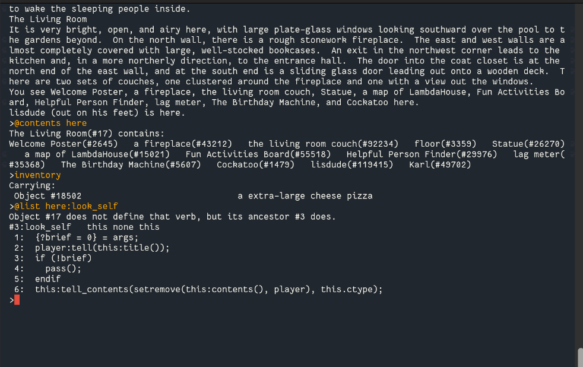
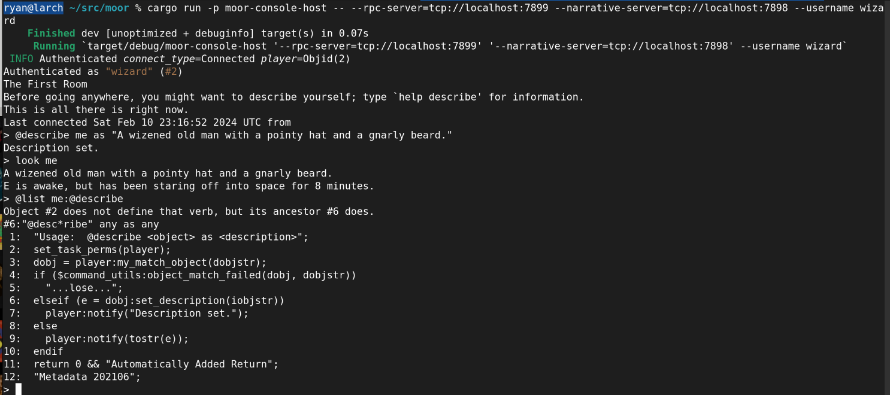
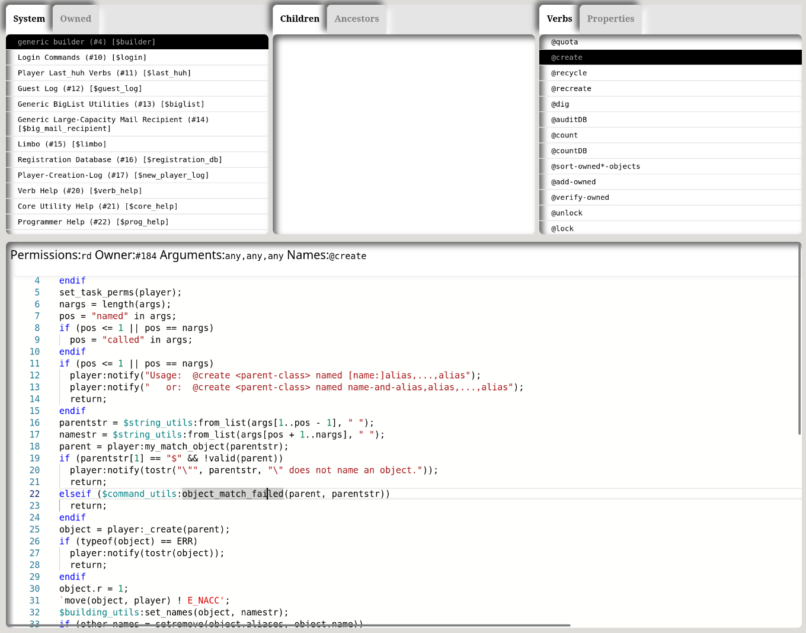

<div style="display: flex; justify-content: flex-start;">
  <div style="width: 200px; background-color: #f0f0f0; padding: 10px; margin: 10px; border-radius: 10px;">
    <p style="font-size: 1.5em; margin: 0; padding: 0; font-family: 'Fantasque Sans Mono',sans-serif">
      <b>M</b>ultiuser<br/>
      &nbsp;<b>O</b>nline<br/>
      &nbsp;&nbsp;<b>O</b>bjects &<br/>
      &nbsp;&nbsp;&nbsp;<b>R</b>elations
    </p>
  </div>
  
</div>

## What is this?

"**_Moor_**" is:

- A system for building shared, programmable, Internet-accessible virtual _social spaces_
- A programming and authoring _tool_ for shared environments.
- Compatible with [LambdaMOO](https://en.wikipedia.org/wiki/MOO) 1.8.x

_Moor_ provides (from the bottom layer up...)

- A fast, durable, transactional networked database with object and relational characteristics
- A runtime for securely live-authoring and hosting programs and content that run persistently on that database
- An authentication and authorization system for controlling access to said programs ("verbs") and content.
- A programming language for building objects and verbs, along with the ability to plug in other languages / runtimes.
- Tools and user environments for interacting with the system and writing verbs and editing content.
- Compatibility with the classic LambdaMOO programming language and runtime.

And it is designed to be used for:

- Collaborative virtual environments
- Socializing
- Multiuser games
- Persistent agents
- Interactive fiction
- Your entertainment and delight

### Why?

Socializing, authoring, and creating on the Internet is in many ways broken. We want to make it better, by giving people
tools to create their _own_ spaces, and to create their own _things_ and _tools_ within those spaces.

It should be fun, it should be easy, it should be accessible, it should be open, it should be collaborative, it should
be programmable, it should be extensible, it should be secure, it should be private, it should be free.

This kind of environment is our take on how we can make that happen:

- Shared, self-authored, spaces
- Where you make things together
- Easy to learn tools
- Easy to share what you make
- Secure, and as private as you want it to be
- Driven around a shared narrative

In short: Build your own village.

### Background

Launching in the early 1990s [LambdaMOO](https://en.wikipedia.org/wiki/LambdaMOO) is an online social environment, as
well as an open source software package for building such environments for yourself.

LambdaMOO -- the place -- still exists today, with an unbroken 30+ year history, and a small but dedicated community of
users and developers continue to use it -- both [LambdaMOO the place](https://lambda.moo.mud.org/), and
[MOO the server software](https://github.com/wrog/lambdamoo) for other communities.

MOO predates "social media", predates Facebook, Twitter, MySpace, Friendster, Tumblr, GeoCities, and... everything else.

In fact, it predates the world-wide web itself, and offers a very different kind of interaction with the Internet, one
that is synchronous and live, text-based, not graphical, and is based around an evolving narrative that the users
themselves create.

It is a multiuser virtual world, a MUD, a narrative "game", a chat room, a virtual environment, a social network, a
programming environment, and a platform for collaborative fiction -- all in one.

It is a place where people can meet, talk, and build things together. And it's kind of awesome.


(for a longer description, see [doc/lambda-background.md](./doc/lambda-background.md))

### Back to the Future

But it some senses, the actual technology did not age well at all. It lacks multimedia of any kind, its interface is
dated, it is not very accessible to new users, and the once active community of developers and participants has
dwindled to a small but dedicated group of enthusiasts.

And the server itself is aged; it is written in C -- is single threaded, with some known architectural limitations, and
is not very easy to extend or modify. While there are newer versions and forks (such as Stunt, ToastStunt, etc.) that
address many of these issues, they are still based on the same original codebase and architecture -- remaining bound by
the single-threaded, single-core model of the original.

_Moor_ is an attempt to reimagine LambdaMOO for the modern world, while retaining the core concepts and ideas that made
it so compelling in the first place. It is a ground-up rewrite (in Rust). And while it maintains full compatibility with
existing LambdaMOO "cores" (databases, worlds), it also offers a new, more flexible and extensible architecture, and
extensions to the runtime to make it more adaptable to modern use cases:

- A web-native architecture which allows for richer clients than a standard text-based terminal, including graphical
  clients, web clients, and mobile clients. Images, videos, emojis, rich text are all feasible, while keeping the
  narrative metaphor and creative aspects of the system intact.
- A multi-core, multi-threaded, runtime, with a transactional, multiversion concurrency model instead of a global
  lock on the database, as in MOO. This allows for theoretically greater scalability.
- A flexible, pluggable virtual machine environment which allows "verbs" to be written in alternative languages,
  such as JavaScript or WebAssembly modules (WIP).

### How do I use it?

The primary audience _at this time_ is developers and administrators of existing MOO environments, and people who are
interested in building new MOO environments, or people who are interested in extending this system out along the
vision described below (under _"What's next?"_).

If you're an existing MOO administrator, you can run your existing MOO database on Moor, and it should work just fine,
with the following caveats:

- No external network connection support or builtins for that. (Web front ends and alternative protocols are done
  in the Rust server layer, not in the MOO core.)
- Little support for the extensions present in ToastStunt, Stunt, etc. (e.g. WAIFs etc.). (Some of these may
  come in the future. Or not. Stunt-compatible Maps _were_ added, recently).

The easiest way to get started is to run the `docker compose` setup. This will bring up a complete server with `telnet`
and `websocket` interfaces. The server will be setup with an initial `JaysHouseCore` core import.

To run, take a look at the local `docker-compose.yml` file, instructions are there, but it really just amounts to:

```
docker compose up
```

This setup is intended for development and testing. In particular, all binaries are compiled in (slower, fatter) debug
mode, and any changes to the source code will cause a rebuild of the server, and a restart of the server. This is useful
for development, but not for production.

However, the `docker-compose.yml` file is a good starting point for understanding how to run the server in a production
environment. The server is composed of a number of services, including the `moor-daemon` binary, and various
"host" services which provide the actual interfaces to the server.

### How is this thing put together? What even is it?

The server is written in Rust, and is composed of a number of crates and running services. These services communicate
with the main server process over an RPC system and message bus implemented on top of ZeroMQ.

For a high level architecture description plus a more detailed breakdown on how the server is put together, see the
[ARCHITECTURE.md](./doc/ARCHITECTURE.md) document.

### License?

_Moor_ is licensed under the GNU General Public License, version 3.0. See the [LICENSE](./LICENSE) file for details.

You can make modifications as you like, but if you distribute those modifications, you must also distribute the source
code for those modifications under the same license.

The choice to use the GPL was made to ensure that the software remains open and free, and that any modifications to it
are also open and free. This is in keeping with the spirit of the original LambdaMOO server, which was also under the
GPL license.

Further, since portions of the code inside `moor` are based on readings of the LambdaMOO server code, staying with
the GPL is the right thing to do.

### Who made this?

The bulk of development has been by [myself](https://github.com/rdaum).

Extensive work on the decompiler/unparser, along with general testing, code sanitization, and cleanup has been done by
[Norman Nunley](https://github.com/nnunley).

Implementation of a robust integration testing framework, along with porting a pile of tests from ToastStunt, and
generally finding bugs and helping with the fixing of them has been done by [Zoltán Nagy](https://github.com/abesto).

There's been plenty of inspiration and help from a community of fellow old-school MOO
(and [ColdMUD](https://muds.fandom.com/wiki/ColdMUD)!) folks that I've known since the 90s.

Finally, LambdaMOO _itself_ was primarily authored by Pavel Curtis, with the original LambdaMOO server being written by
Stephen White. Successive versions and forks have been maintained by a number of people.

### What's done?

At this point `Moor` is capable of executing most of the LambdaMOO 1.8.x system, and is capable of running existing
LambdaMOO databases. This includes support for the full language, the bulk of builtin functions (enough to run the cores
I've tried),
the scheduler including forked and suspended tasks (including persisting them between restarts), importing and exporting
existing LambdaMOO compatible textdumps, the `read()` builtin and user input, and a network layer that supports both
telnet and websockets,
and can be extended to support other protocols.

`Moor` also adds, on top of LambdaMOO 1.8.x:

- Support for map/dictionary types using the same syntax as Stunt/ToastSunt.
- Lexically (block) scoped variables; allows local variables in the context of `for`/`endfor`, `try`/`endtry`,
  `while`/`endwhile`, `if`/`endif`, and a new `begin`/`end` block.
- Transmission of values other than strings (and MOO type) over `notify` when the transport layer is `websocket`
  (currently transmitted as JSON)

With some caveats:

- Outbound network connections are not supported.
- Extensions present in ToastStunt, Stunt, etc. WAIFs, etc. are not supported. Some of these are
  possible to add in the future, others do not fit the design philosophy of the system going forward.

For a list of the status of the implementation of standard LambdaMOO builtin functions, see
[builtin_functions_status.md](./doc/builtin_functions_status.md).



### What's next?

There's a lot of work to do. We're looking for contributors, testers, and users. We're also looking for feedback, ideas,
and use cases.

We're also looking for funding, and for partners who want to build things on top of Moor.

The immediate horizon is to get the initial release out, which will be a drop-in replacement for LambdaMOO, with
some additional features. This will include a web-based client. To get there the following is still required

- Robustness and stability work.
- Correctness testing using tools like Jepsen and Stateright to prove out the transactional model & scheduler
- Performance testing to ensure that the system can handle a large number of users and objects.
- Documentation, including a user manual, a developer manual, and a system administrator manual.
- And maybe outbound network connections, but that's a _maybe_.

The intent is to get to a 1.0 release after these are done. This 1.0 release will be fully compatible with existing
LambdaMOO databases, and will be a drop-in replacement for LambdaMOO.

The roadmap for **future** _features_ after the initial 1.0 release include:

- A more modern, web-based client. The start of this has been sketched out in the `web` host repository, but
  it's still very early. The intent is to provide a more modern, graphical, and interactive experience, while
  still retaining the narrative and creative aspects of a MOO. It will additionally provide modern authoring
  tools like a syntax highlighting, auto-indenting editor, a Smalltalk-style object browser, and a debugger.
  Some prototype work on this has already been done:
  
- Support for alternative languages and runtimes for verbs. The initial plan is to support JavaScript as a verb
  authoring language in addition to MOO. Verbs written in other languages will have access to the same object
  environment as MOO verbs, and will be able to call MOO verbs and be called by MOO verbs. Lua, and WebAssembly
  are also potential candidates for the future.
- Support for a richer data model which includes aspects of a logic programming language model. Programmers / authors
  will be able to declare first class relations between objects, and query them. The idea here is to take the
  grunt work out of building complex, multi-user, social systems, and to make it easier to build things that have
  complicated interactive behaviors.
- Support for multimedia content, including images, videos, and audio. This will be done in a way that is consistent
  with the narrative metaphor of the system, and will be programmable and extensible.
- A better permissions model, including support for more fine-grained access control, and a more modern, user-friendly
  interface for managing permissions. MOO-style fixed, knowable object numbers (`#123` style) will be replaced or
  subsumed by object-capability references. The challenge being to maintain backwards compatibility with existing
  cores.

### Join us!

If you're interested in helping out, or just want to chat, please join us on
our [Discord server](https://discord.gg/f5NnYJBfcG).

Note: When the time is right the Discord will be replaced by a running instance of `moor` itself.
